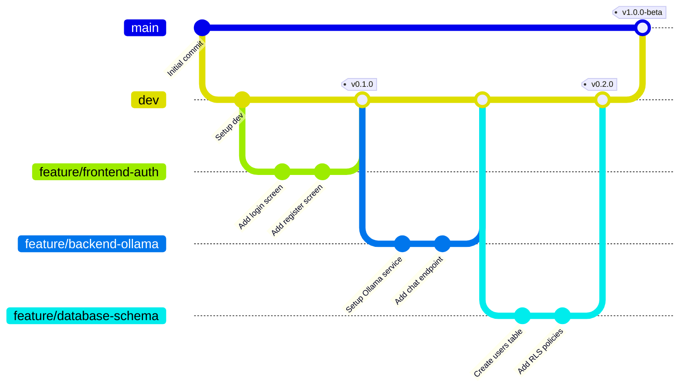
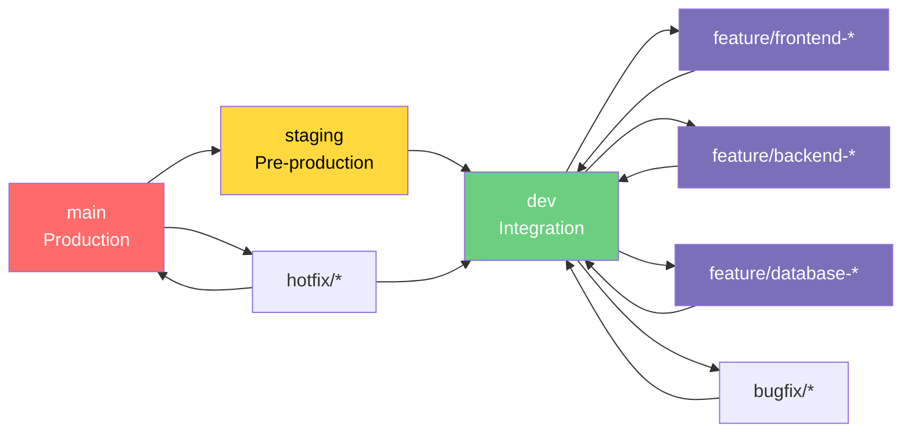
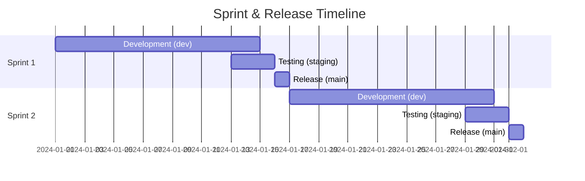

# 🌿 LENTERA - Git Branch Strategy

## Visualisasi Branching Strategy



## Branch Flow Diagram



## Team Member Branches

```mermaid
graph TD
    DEV[dev branch]
    
    subgraph "Frontend Lead"
        F1[feature/frontend-auth-ui]
        F2[feature/frontend-chat-screen]
        F3[feature/frontend-voice-call]
        F4[feature/frontend-mood-tracker]
    end
    
    subgraph "Backend Lead"
        B1[feature/backend-ollama-integration]
        B2[feature/backend-websocket]
        B3[feature/backend-whisper-stt]
        B4[feature/backend-tts]
    end
    
    subgraph "Database Lead"
        D1[feature/database-schema]
        D2[feature/database-auth-integration]
        D3[feature/database-realtime]
        D4[feature/database-rls-policies]
    end
    
    DEV --> F1
    DEV --> F2
    DEV --> F3
    DEV --> F4
    
    DEV --> B1
    DEV --> B2
    DEV --> B3
    DEV --> B4
    
    DEV --> D1
    DEV --> D2
    DEV --> D3
    DEV --> D4
    
    F1 --> DEV
    F2 --> DEV
    F3 --> DEV
    F4 --> DEV
    
    B1 --> DEV
    B2 --> DEV
    B3 --> DEV
    B4 --> DEV
    
    D1 --> DEV
    D2 --> DEV
    D3 --> DEV
    D4 --> DEV
    
    style DEV fill:#6bcf7f,color:#fff,stroke:#333,stroke-width:4px
```



## Quick Reference

### Branch Hierarchy
```
main (Production-ready code)
  └── staging (Pre-production testing)
      └── dev (Development integration)
          ├── feature/* (New features)
          ├── bugfix/* (Bug fixes)
          └── hotfix/* (Critical fixes from main)
```

### Protection Rules

| Branch | Protections |
|--------|-------------|
| **main** | • Require PR review (2 approvals)<br/>• Require status checks<br/>• No force push<br/>• No delete |
| **staging** | • Require PR review (1 approval)<br/>• Require status checks<br/>• No force push |
| **dev** | • Require PR review (1 approval)<br/>• Squash merge only |
| **feature/*** | • No restrictions<br/>• Delete after merge |

### Naming Patterns

**Frontend Lead:**
- `feature/frontend-<nama-fitur>`
- Examples: `feature/frontend-auth-ui`, `feature/frontend-chat-screen`

**Backend Lead:**
- `feature/backend-<nama-fitur>`
- Examples: `feature/backend-ollama`, `feature/backend-websocket`

**Database Lead:**
- `feature/database-<nama-fitur>`
- Examples: `feature/database-schema`, `feature/database-auth`

**Bug Fixes:**
- `bugfix/<issue-number>-<deskripsi>`
- Examples: `bugfix/42-login-crash`, `bugfix/mood-save-error`

**Hotfixes:**
- `hotfix/<critical-issue>`
- Examples: `hotfix/auth-vulnerability`, `hotfix/api-crash`

---

## Workflow Steps

### 1. Start New Feature
```bash
git checkout dev
git pull origin dev
git checkout -b feature/frontend-auth-ui
```

### 2. Regular Commits
```bash
git add .
git commit -m "feat(auth): implement login screen"
git push origin feature/frontend-auth-ui
```

### 3. Create Pull Request
- Go to GitHub
- Create PR: `feature/frontend-auth-ui` → `dev`
- Add description, screenshots, reviewers
- Wait for approval

### 4. After Merge
```bash
git checkout dev
git pull origin dev
git branch -d feature/frontend-auth-ui  # Delete local branch
```

### 5. Release Process
```bash
# Weekly: dev → staging
git checkout staging
git merge dev
git push origin staging

# After testing: staging → main
git checkout main
git merge staging --no-ff
git tag -a v1.0.0 -m "Release v1.0.0"
git push origin main --tags
```

---

## Sprint Release Cycle



**Timeline:**
- **Week 1-2**: Development di feature branches → merge ke `dev`
- **Day 13-15**: Testing di `staging`
- **Day 16**: Release ke `main` dengan version tag

---

## Conflict Resolution

### If Merge Conflict Occurs:

```bash
# Update your branch with latest dev
git checkout feature/your-branch
git fetch origin
git merge origin/dev

# Resolve conflicts in editor
# After resolving:
git add .
git commit -m "merge: resolve conflicts with dev"
git push origin feature/your-branch
```

### Prevention Tips:
- ✅ Pull `dev` regularly (daily)
- ✅ Keep feature branches small & focused
- ✅ Merge to `dev` frequently
- ✅ Communicate with team about overlapping work

---

## GitHub Project Board

**Recommended Columns:**
1. 📋 **Backlog** - Tasks yang akan dikerjakan
2. 🎯 **Sprint** - Tasks untuk sprint saat ini
3. 🔨 **In Progress** - Sedang dikerjakan
4. 👀 **In Review** - PR waiting for review
5. ✅ **Done** - Completed & merged

**Move cards:**
- Backlog → Sprint (Sprint planning)
- Sprint → In Progress (Start working)
- In Progress → In Review (Create PR)
- In Review → Done (After merge)

---

Simpan file ini sebagai referensi tim! 🚀
