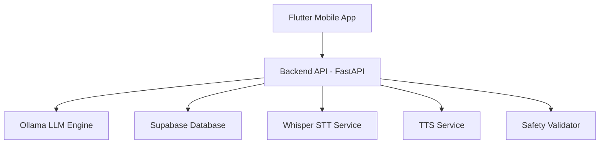

# 📊 Template Presentasi MONEV - LenteraDreamFlow

> **Petunjuk Penggunaan**: Template ini dirancang untuk presentasi monitoring dan evaluasi (monev) proyek LenteraDreamFlow di depan reviewer. Setiap slide memiliki struktur konten yang jelas dan dapat disesuaikan dengan progress terkini.

---

## 🎯 Struktur Presentasi (15-20 Slide)

### **SECTION 1: PEMBUKAAN** (3 Slide)

#### Slide 1: Cover Slide
```
┌─────────────────────────────────────────┐
│                                         │
│        LENTERADREAMFLOW                 │
│   Companion AI untuk Kesehatan Mental   │
│                                         │
│    Monitoring & Evaluasi Proyek         │
│         Periode: [Bulan Tahun]          │
│                                         │
│         Tim: [Nama-nama Anggota]        │
│                                         │
└─────────────────────────────────────────┘
```
**Visual**: Logo proyek di tengah, background gradient modern (biru/ungu yang menenangkan)
**Font**: Besar dan bold untuk judul utama

---

#### Slide 2: Agenda Presentasi
**Judul**: Agenda

1. 🎯 **Overview Proyek & Milestone**
2. 📊 **Progress Teknis Terkini**
3. 🏆 **Pencapaian Utama**
4. 🚧 **Tantangan & Solusi**
5. 📅 **Rencana ke Depan**
6. 💰 **Budget & Resources**
7. ❓ **Q&A**

**Design**: Numbering dengan icon, layout clean

---

#### Slide 3: Overview Proyek
**Judul**: LenteraDreamFlow: Inovasi Kesehatan Mental Digital

**Konten**:
- **Visi**: Menyediakan akses 24/7 untuk dukungan kesehatan mental melalui AI yang empatik dan aman
- **Target User**: Remaja dan dewasa muda (18-35 tahun) yang membutuhkan dukungan emosional
- **Keunggulan Utama**:
  - 🤖 AI Chat dengan model LLM teroptimasi
  - 🎤 Real-time Voice Call (Speech-to-Text & Text-to-Speech)
  - 📊 Mood Tracking terintegrasi
  - 🛡️ Safety Guardrails untuk krisis detection

**Visual**: Diagram sederhana menunjukkan user → app → AI system

---

### **SECTION 2: ARSITEKTUR & TEKNOLOGI** (3 Slide)

#### Slide 4: Arsitektur Sistem
**Judul**: Arsitektur Teknis End-to-End

**Konten**:


**Keterangan**:
- Frontend: Flutter (Cross-platform iOS/Android)
- Backend: FastAPI (Python) + WebSocket
- AI Engine: Ollama (Llama 3.1)
- Database: Supabase (PostgreSQL + Auth)
- Voice: Faster-Whisper (STT) + Custom TTS
- Deployment: Docker + VPS

**Visual**: Diagram arsitektur dengan warna berbeda untuk setiap layer

---

#### Slide 5: Tech Stack Detail
**Judul**: Teknologi yang Digunakan

| Layer | Teknologi | Justifikasi |
|-------|-----------|-------------|
| **Frontend** | Flutter 3.0+ | Cross-platform, single codebase |
| **Backend** | FastAPI + Python | High-performance async, mudah integrasi AI |
| **AI Model** | Ollama (Llama 3.1) | Open-source, dapat di-deploy on-premise |
| **Database** | Supabase | Real-time, built-in auth, PostgreSQL |
| **Voice AI** | Faster-Whisper | Optimized untuk CPU, akurat untuk Bahasa Indonesia |
| **DevOps** | Docker + Nginx | Reproducible environment, scalable |
| **Version Control** | Git + GitHub | Kolaborasi tim, versioning jelas |

**Visual**: Icon untuk setiap teknologi (jika ada)

---

#### Slide 6: Fitur Keamanan AI
**Judul**: AI Safety & Ethics System 🛡️

**Konten**:
**Mengapa Safety Penting?**
- Aplikasi mental health berisiko tinggi untuk self-harm/suicide detection
- AI harus capable dalam men-detect dan me-respond situasi krisis

**Implementasi Safety Guardrails**:
1. **Input Validation** (`safety_validator.py`)
   - Deteksi keyword berbahaya (bunuh diri, self-harm, kekerasan)
   - Pattern recognition untuk konteks ambigu

2. **Crisis Handler** (`crisis_handler.py`)
   - Prosedur eskalasi otomatis
   - Template respons tervalidasi oleh profesional kesehatan mental
   - Hard boundaries: AI tidak memberikan medical advice

3. **Template Override v2**
   - Sistem memaksa AI menggunakan respons aman saat detect ambiguitas
   - Contoh: "Saya merasa sendirian" → AI wajib empati + suggest hotline

**Visual**: Flowchart sederhana menunjukkan input → validation → response

---

### **SECTION 3: PROGRESS TERKINI** (4-5 Slide)

#### Slide 7: Timeline Progress
**Judul**: Milestone Timeline Proyek (12 Minggu)

**Konten**:
```
Minggu 1-2: ✅ Planning & Setup
├─ Riset teknologi & arsitektur
├─ Setup development environment
└─ Database schema design

Minggu 3: ✅ Core Development
├─ Backend API (Chat, Auth, Mood)
├─ Frontend UI/UX Implementation
└─ Database integration (Supabase)

Minggu 4: ✅ Advanced Features
├─ Voice Call Pipeline (Code Complete)
├─ AI Safety System (Active)
├─ Fine-tuning preparation
└─ Frontend-Backend integration

Minggu 5: 🔄 Integration & Testing (CURRENT)
├─ End-to-end testing
├─ Voice features activation
├─ Performance optimization
└─ Bug fixes & refinement

Minggu 6-8: 📋 Feature Enhancement
├─ Additional features implementation
├─ UI/UX improvements
├─ User feedback integration
└─ Documentation updates

Minggu 9-10: 🧪 Testing & Quality Assurance
├─ Comprehensive testing (UAT)
├─ Security audit
├─ Performance tuning
└─ Deployment preparation

Minggu 11-12: 🚀 Final Deployment & Presentation
├─ Production deployment
├─ Final documentation
├─ Presentation preparation
└─ Project handover
```

**Visual**: Timeline horizontal atau vertical dengan color-coded phases

---

#### Slide 8: Pencapaian Terkini (Highlights)
**Judul**: 🏆 Key Achievements - Week 1-4 Summary

**Konten**:

### 1️⃣ Real-time Voice Pipeline 🎤
- ✅ **Status**: Code Complete (Currently Disabled)
- **Detail**: 
  - WebSocket endpoint `/ws/voice-call` ready
  - STT (Faster-Whisper) + TTS fully integrated
  - Pipeline: Audio → Transcribe → LLM → Synthesize → Audio
- **Alasan Disable**: Menghemat RAM untuk dev iteration, akan di-enable saat testing

### 2️⃣ AI Safety System 🛡️
- ✅ **Status**: Active & Deployed
- **Impact**: Sistem dapat detect dan handle krisis dengan aman

### 3️⃣ Frontend Integration 📱
- ✅ **Status**: Fully Integrated
- **Detail**: Mood Service terhubung ke Supabase dengan fallback mechanism

**Visual**: 3 kolom dengan icon, status badge (hijau/kuning), dan brief description

---

#### Slide 9: Status Komponen Teknis
**Judul**: 📊 Status Dashboard Komponen

| Komponen | Fitur | Status | Keterangan |
|----------|-------|:------:|------------|
| **Backend** | WebSocket Voice | 🟡 **Pending** | Kode siap, perlu enable & test |
| **Backend** | AI Chat (Text) | 🟢 **Active** | Terintegrasi dengan Safety |
| **Backend** | Whisper STT | 🟡 **Ready** | Service siap, tunggu integrasi |
| **Frontend** | Mood Tracker | 🟢 **Active** | Connected to Supabase |
| **Frontend** | Chat Interface | 🟢 **Active** | Real-time messaging |
| **Database** | Schema & Auth | 🟢 **Active** | Stabil, no issues |
| **DevOps** | Docker Setup | 🟢 **Active** | All dependencies included |

**Legenda**:
- 🟢 Active/Done
- 🟡 Ready/Pending Testing
- 🔴 Blocked/Issue

**Visual**: Table dengan color-coded status

---

#### Slide 10: Demo Screenshots
**Judul**: Interface & User Experience

**Konten**:
- **Screenshot 1**: Chat interface dengan AI response
- **Screenshot 2**: Mood tracker screen
- **Screenshot 3**: Safety response example (blurred sensitive content)
- **Screenshot 4**: Settings/Profile page

**Layout**: Grid 2x2 atau carousel

**Catatan**: Bisa request screenshot dari flutter app saat testing

---

#### Slide 11: Code Quality & Documentation
**Judul**: Best Practices & Code Quality

**Metrics**:
- ✅ **Version Control**: Git dengan meaningful commit messages
- ✅ **Documentation**: 
  - `WEEK_4_REPORT.md` - Progress report
  - `FINE_TUNING_GUIDE.md` - AI training guide
  - Inline code comments untuk complex logic
- ✅ **Code Structure**: 
  - Modular architecture (services, handlers, validators)
  - Separation of concerns (frontend/backend)
- ✅ **Dependencies Management**: 
  - `requirements.txt` updated
  - Docker containers untuk reproducibility

**Visual**: Checkmarks dengan brief explanation

---

### **SECTION 4: TANTANGAN & SOLUSI** (2 Slide)

#### Slide 12: Tantangan Teknis
**Judul**: 🚧 Challenges Encountered

| Tantangan | Impact | Status Solusi |
|-----------|--------|---------------|
| **Resource Consumption** | RAM tinggi saat Whisper + Ollama bersamaan | 🔄 Planning load testing & optimization |
| **Voice Call Latency** | Potensi delay pada real-time conversation | 🔄 Butuh testing WebSocket performance |
| **Model Fine-tuning** | Data training quality untuk konteks Indonesia | ✅ Prepared scripts & guide |
| **Deployment Complexity** | Multiple services perlu orchestration | ✅ Solved dengan Docker |

**Visual**: Table dengan icon untuk severity/priority

---

#### Slide 13: Risk Mitigation
**Judul**: Mitigasi Risiko & Strategi

**Konten**:

1. **Risiko: Model AI Hallucination**
   - Mitigasi: Safety validator + template override
   - Testing: Scenario-based testing dengan edge cases

2. **Risiko: Server Downtime**
   - Mitigasi: Docker untuk quick recovery, monitoring tools
   - Backup: VPS snapshot regular

3. **Risiko: Data Privacy**
   - Mitigasi: Supabase Row-Level Security (RLS)
   - Compliance: No medical data stored long-term

4. **Risiko: Budget Overrun**
   - Mitigasi: Open-source tech stack, on-premise LLM
   - Monitoring: Monthly expense tracking

**Visual**: Risk matrix atau list dengan mitigation pairs

---

### **SECTION 5: RENCANA KE DEPAN** (2-3 Slide)

#### Slide 14: Roadmap ke Depan (Minggu 5-12)
**Judul**: 📅 Next Steps & Priorities

**Minggu 5-6: Integration & Enhancement** (CURRENT)
- [ ] Enable Voice Call features di production
- [ ] End-to-end testing (Frontend ↔ Backend ↔ AI)
- [ ] Load testing untuk RAM/CPU usage
- [ ] Additional features & UI improvements

**Minggu 7-8: Feature Completion**
- [ ] User feedback implementation
- [ ] Advanced AI features (jika applicable)
- [ ] Performance optimization
- [ ] Documentation updates

**Minggu 9-10: Testing & QA**
- [ ] Comprehensive User Acceptance Testing (UAT)
- [ ] Security audit & vulnerability testing
- [ ] Bug fixes & stability improvements
- [ ] Deployment rehearsal

**Minggu 11-12: Final Deployment & Wrap-up**
- [ ] Production deployment
- [ ] Final documentation & handover
- [ ] Presentation preparation
- [ ] Project closure activities

**Visual**: Gantt chart atau roadmap visual dengan milestones

---

#### Slide 15: Success Metrics
**Judul**: KPI & Success Indicators

**Metrik Teknis**:
- ✅ API Response Time < 2 detik
- ✅ Voice Call Latency < 500ms
- ✅ System Uptime > 99%
- ✅ Zero critical security vulnerabilities

**Metrik User Experience**:
- 🎯 User satisfaction score (dari UAT)
- 🎯 Mood tracking retention rate
- 🎯 Safety system accuracy (crisis detection)

**Metrik Business** (jika applicable):
- 🎯 Cost per active user
- 🎯 Deployment success rate

**Visual**: Gauge charts atau progress bars

---

#### Slide 16: Budget & Resources
**Judul**: 💰 Budget Allocation & Resource Usage

**Breakdown Biaya**:
| Item | Budget | Actual | Status |
|------|--------|--------|--------|
| VPS Hosting | Rp XXX | Rp XXX | ✅ On track |
| Domain & SSL | Rp XXX | Rp XXX | ✅ Paid |
| Development Tools | Rp 0 | Rp 0 | ✅ Free (open-source) |
| API Costs (jika pakai cloud AI) | Rp XXX | Rp XXX | 🟢/🟡 |
| **Total** | **Rp XXX** | **Rp XXX** | **XX% used** |

**Tim Resources**:
- Developer: X orang
- Designer: X orang
- Total Man-hours: XXX jam

**Visual**: Pie chart untuk budget distribution

---

### **SECTION 6: PENUTUP** (2-3 Slide)

#### Slide 17: Lessons Learned
**Judul**: 📚 Key Learnings

**Technical Learnings**:
- ✅ Docker sangat membantu untuk reproducible environment
- ✅ Safety validator adalah critical component untuk mental health app
- ✅ On-premise LLM (Ollama) feasible untuk Indonesia

**Process Learnings**:
- ✅ Weekly report membantu tracking progress
- ✅ Modular architecture mempercepat iteration
- ⚠️ Perlu alokasi lebih untuk testing phase

**Visual**: Bullet points dengan icon

---

#### Slide 18: Demo Request / Q&A Preparation
**Judul**: 💡 Demo & Discussion

**Konten**:
"Kami siap untuk:"
- 🖥️ **Live Demo**: Chat interface + Safety system
- 📱 **Mobile App Walkthrough** (jika ada device)
- 💬 **Technical Discussion**: Arsitektur & design decisions
- 🔍 **Code Review**: Bersedia menunjukkan code quality

**Prepared to Answer**:
- Scalability strategy
- Data privacy & compliance
- Alternative architecture considerations
- Budget & timeline justification

**Visual**: Icon-based layout

---

#### Slide 19: Thank You & Contact
**Judul**: Terima Kasih

**Konten**:
```
┌─────────────────────────────────────────┐
│                                         │
│          TERIMA KASIH                   │
│                                         │
│   Questions & Feedback Welcome!         │
│                                         │
│   Contact:                              │
│   📧 Email: [email proyek]              │
│   💻 GitHub: [repository URL]           │
│   📱 Team Lead: [nama & kontak]         │
│                                         │
└─────────────────────────────────────────┘
```

**Visual**: Clean, centered layout dengan gradient background

---

## 🎨 Design Guidelines

### Color Palette (Konsisten dengan Mental Health Theme)
- **Primary**: `#4A90E2` (Calming blue)
- **Secondary**: `#7B68EE` (Gentle purple)
- **Accent**: `#50E3C2` (Refreshing teal)
- **Text**: `#2C3E50` (Dark gray)
- **Background**: `#F8F9FA` (Light gray) atau `#FFFFFF` (White)
- **Success**: `#00D084` (Green)
- **Warning**: `#FFB020` (Orange)
- **Danger**: `#FF4757` (Red - untuk crisis indicators)

### Typography
- **Heading**: **Poppins Bold** atau **Montserrat Bold** (Modern, readable)
- **Body**: **Open Sans** atau **Roboto** (Clean, professional)
- **Code**: **Fira Code** atau **JetBrains Mono** (Untuk code snippets)

### Icons
- Gunakan Feather Icons, Material Icons, atau Font Awesome
- Konsisten dalam style (outline vs filled)
- Size: 48px untuk section icons, 24px untuk inline icons

### Slide Layout
- **Margin**: Minimal 1 inch dari edge
- **Content**: Jangan terlalu padat, gunakan whitespace
- **Images**: High-resolution, compress untuk file size optimal
- **Animations**: Minimal, hanya untuk key transitions (fade/slide)

---

## 📝 Tips Presentasi

### Sebelum Presentasi
1. ✅ **Rehearse** minimal 2x untuk timing (15-20 menit)
2. ✅ **Backup Plan**: PDF version jika PowerPoint gagal
3. ✅ **Demo Ready**: Pastikan backend running, Flutter app installed
4. ✅ **Prepare Q&A**: Antisipasi pertanyaan teknis & non-teknis

### Saat Presentasi
1. 🎯 **Opening Strong**: Jelaskan problem yang diselesaikan (slide 3)
2. 🛡️ **Highlight Safety**: Emphasize AI safety karena ini unique value
3. 📊 **Data-Driven**: Tunjukkan metrics & status yang konkret
4. 💬 **Interactive**: Tanyakan apakah reviewer punya concern tertentu
5. ⏰ **Time Management**: Allocate 3-4 menit untuk Q&A

### Handling Q&A
- **Jika tahu jawabannya**: Jawab langsung dengan detail teknis
- **Jika tidak yakin**: "Pertanyaan bagus, saya akan riset lebih lanjut dan follow up"
- **Jika kritik**: Terima dengan profesional, jelaskan mitigasi yang sudah/akan dilakukan

---

## 📦 Deliverables

File yang perlu disiapkan:
1. ✅ **PowerPoint (.pptx)**: Template ini dalam format PPT
2. ✅ **PDF Backup**: Export to PDF untuk kompatibilitas
3. ✅ **Screenshot Folder**: Semua screenshot app di folder terpisah
4. ✅ **Speaker Notes**: Catatan untuk setiap slide (di PowerPoint notes section)
5. ✅ **Demo Checklist**: Rundown untuk live demo (jika ada)

---

## 🔗 Resources

- **Project Repository**: [Link GitHub LenteraDreamFlow]
- **Week 4 Report**: `WEEK_4_REPORT.md`
- **Fine-tuning Guide**: `FINE_TUNING_GUIDE.md`
- **Architecture Diagrams**: [Jika ada folder /docs]

---

**Template Created**: January 2026  
**Last Updated**: [Tanggal Hari Ini]  
**Version**: 1.0

---

> 💡 **Pro Tip**: Sesuaikan konten dengan audience reviewer. Jika reviewer lebih teknis, deep dive ke arsitektur. Jika reviewer lebih business-oriented, fokus ke impact & budget.
