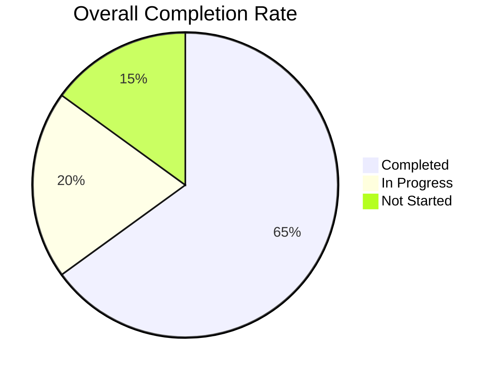
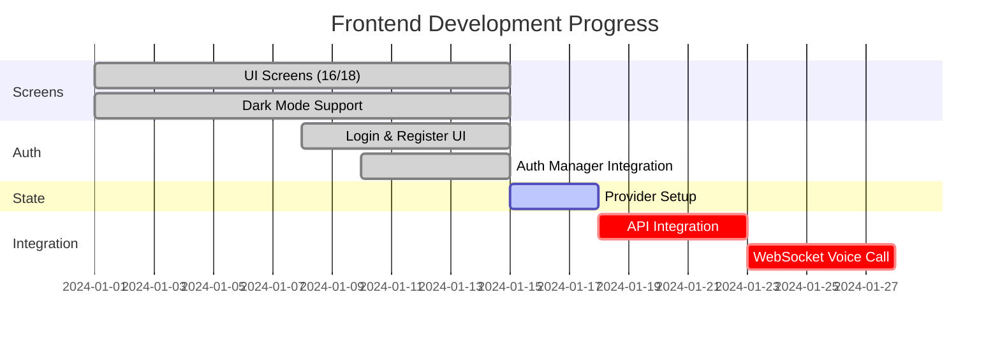
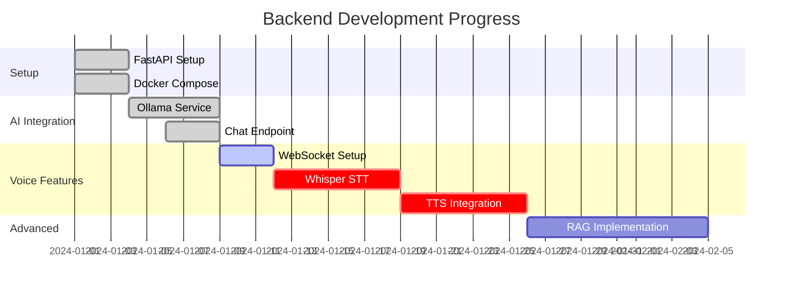
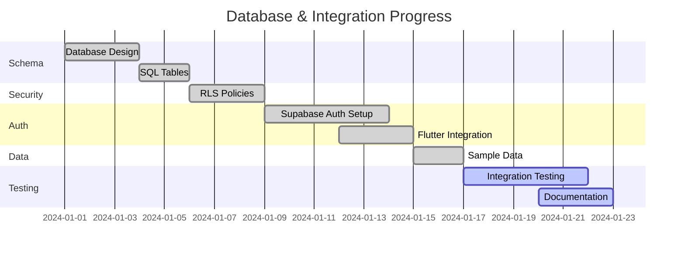
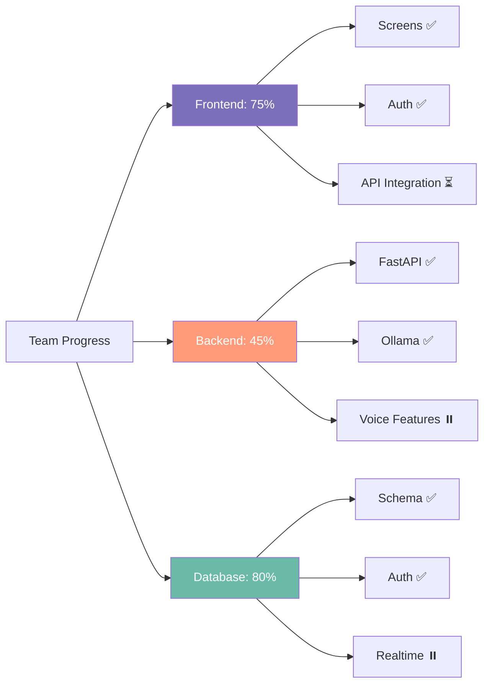
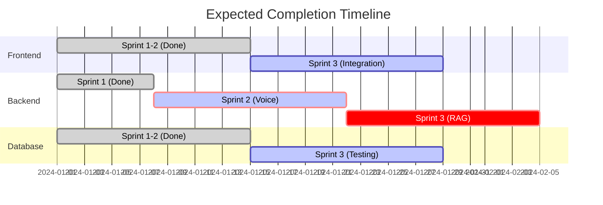

# 📊 LENTERA - Team Progress Report

**Generated**: 2025-12-17  
**Sprint Status**: In Progress

---

## 🎯 Overall Project Progress



**Total Progress**: 65% Complete ✅

---

## 👥 Progress per Team Member

### 📱 **Member 1: Frontend Lead** - 75% Complete



#### ✅ Completed Tasks (Sprint 1 & 2)

**Screens Implemented** (16/18):
- ✅ `splash_screen.dart` - Splash & onboarding
- ✅ `login_screen.dart` - Login UI
- ✅ `signup_screen.dart` - Register UI
- ✅ `home_page.dart` - Main dashboard with bottom nav
- ✅ `mood_entry_screen.dart` - Mood tracker input
- ✅ `psychologists_screen.dart` - Psychologist listing
- ✅ `bookings_screen.dart` - Booking management
- ✅ `ai_chat_screen.dart` - AI chat interface
- ✅ `chat_sahabat_lentera_screen.dart` - Chat UI
- ✅ `voice_call_screen.dart` - Voice call UI
- ✅ `video_call_screen.dart` - Video call UI
- ✅ `trivia_screen.dart` - Daily trivia
- ✅ `insight_detail_screen.dart` - Mood insights
- ✅ `edit_profile_screen.dart` - Profile editing
- ✅ `avatar_shop_screen.dart` - Avatar shop
- ✅ `payment_methods_screen.dart` - Payment UI

**Components** (6 components):
- ✅ All reusable components created
- ✅ Mood cards, psychologist cards, etc.

**Models** (6 models):
- ✅ `user.dart`
- ✅ `mood_entry.dart`
- ✅ `psychologist.dart`
- ✅ `conversation.dart`
- ✅ `booking.dart`
- ✅ `avatar.dart`

**Services** (9 services):
- ✅ `mood_service.dart`
- ✅ `psychologist_service.dart`
- ✅ `conversation_service.dart`
- ✅ `booking_service.dart`
- ✅ `user_service.dart`
- ✅ `avatar_service.dart`
- ✅ `gamification_service.dart`
- ✅ `transaction_service.dart`
- ✅ `preferences_service.dart`

**Authentication**:
- ✅ `auth_manager.dart` - Auth interface
- ✅ `supabase_auth_manager.dart` - Supabase integration
- ✅ Login/Register/Logout functionality
- ✅ Email verification flow

**Theme & Design**:
- ✅ Custom theme with therapeutic colors
- ✅ Dark mode support
- ✅ Google Fonts (Inter)
- ✅ Responsive layouts

#### ⏳ In Progress

- 🔨 Provider state management implementation (partially done)
- 🔨 Connect services to Supabase APIs (needs backend)

#### ❌ Not Started (Sprint 3)

- ⏸️ Real-time chat with WebSocket
- ⏸️ Voice call WebSocket integration
- ⏸️ Performance optimization
- ⏸️ Offline mode support

#### 📈 Progress Breakdown

| Category | Completed | Total | % |
|----------|-----------|-------|---|
| **Screens** | 16 | 18 | 89% |
| **Components** | 6 | 6 | 100% |
| **Models** | 6 | 6 | 100% |
| **Services** | 9 | 9 | 100% |
| **Auth Flow** | 1 | 1 | 100% |
| **State Mgmt** | 0.5 | 1 | 50% |
| **API Integration** | 0 | 1 | 0% |
| **WebSocket** | 0 | 1 | 0% |
| **TOTAL** | **38.5** | **43** | **75%** |

---

### ⚙️ **Member 2: Backend Lead** - 45% Complete



#### ✅ Completed Tasks (Sprint 1)

**Core Backend**:
- ✅ `main.py` - FastAPI app setup
- ✅ CORS middleware configured
- ✅ Health check endpoint (`/health`)
- ✅ Basic API structure

**AI Integration**:
- ✅ `ollama_service.py` - Complete Ollama integration
  - ✅ Health check
  - ✅ Model listing
  - ✅ Generate method
  - ✅ Chat method
  - ✅ Mental health system prompt
- ✅ Chat endpoint (`/api/chat`) - Basic implementation

**Docker & Deployment**:
- ✅ `Dockerfile` - Backend container
- ✅ `docker-compose.yml` - Multi-service setup
- ✅ Ollama container configuration
- ✅ Setup scripts (PowerShell & Bash)

**Documentation**:
- ✅ `backend/README.md` - Comprehensive setup guide

#### ⏳ In Progress (Sprint 2)

- 🔨 WebSocket endpoint for voice call (skeleton exists)
- 🔨 Mood analysis endpoint (placeholder)

#### ❌ Not Started (Sprint 2 & 3)

**Voice Features**:
- ⏸️ Whisper STT integration
- ⏸️ TTS integration (Piper/XTTS)
- ⏸️ Voice call pipeline (STT → LLM → TTS)
- ⏸️ Audio processing & encoding

**Advanced AI**:
- ⏸️ RAG (Retrieval Augmented Generation)
- ⏸️ Conversation memory/context management
- ⏸️ Prompt engineering & fine-tuning
- ⏸️ Streaming responses

**Backend Services**:
- ⏸️ Environment variables & config
- ⏸️ Error handling & logging
- ⏸️ API rate limiting
- ⏸️ Authentication middleware

#### 📈 Progress Breakdown

| Category | Completed | Total | % |
|----------|-----------|-------|---|
| **FastAPI Setup** | 1 | 1 | 100% |
| **Docker** | 1 | 1 | 100% |
| **Ollama LLM** | 1 | 1 | 100% |
| **Chat API** | 0.5 | 1 | 50% |
| **WebSocket** | 0.3 | 1 | 30% |
| **Whisper STT** | 0 | 1 | 0% |
| **TTS** | 0 | 1 | 0% |
| **RAG** | 0 | 1 | 0% |
| **Config/Logging** | 0 | 1 | 0% |
| **TOTAL** | **3.8** | **9** | **45%** |

---

### 🗄️ **Member 3: Database Lead** - 80% Complete



#### ✅ Completed Tasks (Sprint 1 & 2)

**Database Schema**:
- ✅ `supabase_tables.sql` - Complete schema
  - ✅ `users` table with auth reference
  - ✅ `psychologists` table
  - ✅ `bookings` table with relationships
  - ✅ `mood_entries` table
  - ✅ `conversations` & `messages` tables
  - ✅ Indexes for performance
  - ✅ Constraints & validations

**Security & Policies**:
- ✅ `supabase_policies.sql` - Row Level Security
  - ✅ User data isolation
  - ✅ Privacy controls
  - ✅ Service role access

**Sample Data**:
- ✅ `supabase_sample_data.sql` - Test data
  - ✅ Psychologists data
  - ✅ Sample bookings
  - ✅ Test users

**Authentication**:
- ✅ Supabase Auth configuration
- ✅ Flutter integration (`supabase_auth_manager.dart`)
  - ✅ Email/Password signup
  - ✅ Email/Password login
  - ✅ Email verification
  - ✅ Password reset
  - ✅ User profile management
  - ✅ Sign out

**TypeScript Types**:
- ✅ `database.types.ts` - Type definitions for frontend

**Configuration**:
- ✅ `supabase_config.dart` - Flutter Supabase client
- ✅ Environment setup

#### ⏳ In Progress (Sprint 2)

- 🔨 `pending_migrations.sql` - Incremental updates
- 🔨 Integration testing documentation

#### ❌ Not Started (Sprint 3)

**Real-time Features**:
- ⏸️ Supabase Realtime for chat
- ⏸️ Live mood entries sync
- ⏸️ Booking notifications

**Testing**:
- ⏸️ End-to-end testing scripts
- ⏸️ Performance testing
- ⏸️ Load testing

**Documentation**:
- ⏸️ API documentation (OpenAPI/Swagger)
- ⏸️ Deployment guide
- ⏸️ Database migration guide

#### 📈 Progress Breakdown

| Category | Completed | Total | % |
|----------|-----------|-------|---|
| **Schema Design** | 1 | 1 | 100% |
| **SQL Tables** | 1 | 1 | 100% |
| **RLS Policies** | 1 | 1 | 100% |
| **Sample Data** | 1 | 1 | 100% |
| **Auth Integration** | 1 | 1 | 100% |
| **TypeScript Types** | 1 | 1 | 100% |
| **Realtime Setup** | 0 | 1 | 0% |
| **Testing** | 0.5 | 1 | 50% |
| **Documentation** | 0.5 | 1 | 50% |
| **TOTAL** | **7** | **9** | **80%** |

---

## 📊 Comparative Progress



### Progress Bar Visualization

**Frontend Lead** (75%):
```
████████████████████████████████████░░░░░░░░░ 75%
```

**Backend Lead** (45%):
```
██████████████████░░░░░░░░░░░░░░░░░░░░░░░░░░░ 45%
```

**Database Lead** (80%):
```
████████████████████████████████████████░░░░░ 80%
```

---

## 🎯 Sprint Status Summary

### Sprint 1 Goals ✅ (Completed)

| Role | Goal | Status |
|------|------|--------|
| Frontend | Auth UI & screens | ✅ Done |
| Backend | FastAPI & Ollama setup | ✅ Done |
| Database | Schema & Auth integration | ✅ Done |

### Sprint 2 Goals ⏳ (In Progress)

| Role | Goal | Status | Progress |
|------|------|--------|----------|
| Frontend | Main features & API integration | 🔨 In Progress | 60% |
| Backend | Voice features (STT/TTS) | ⏸️ Not Started | 0% |
| Database | Realtime & testing | 🔨 In Progress | 70% |

### Sprint 3 Goals ⏸️ (Upcoming)

| Role | Main Focus |
|------|-----------|
| Frontend | WebSocket integration, optimization, testing |
| Backend | RAG implementation, prompt tuning, production config |
| Database | E2E testing, documentation, deployment |

---

## 🚧 Blockers & Dependencies

### 🔴 Critical Issues

1. **Backend → Frontend**: Frontend API integration blocked by incomplete backend endpoints
   - Missing: Real chat API with Ollama
   - Missing: Voice call WebSocket implementation
   
2. **Backend Voice Features**: Whisper & TTS not started
   - Blocker for voice call feature
   - Required for Sprint 2 completion

### 🟡 Medium Priority

1. **State Management**: Provider implementation incomplete
2. **Real-time Features**: Supabase Realtime not configured
3. **Testing**: No automated tests yet

### 🟢 Low Priority

1. **Documentation**: API docs need completion
2. **Performance**: Optimization pending
3. **Monitoring**: Logging & metrics TBD

---

## 📅 Recommended Next Steps

### Week 3-4 (Sprint 2 Completion)

**Frontend Lead**:
1. ✅ Complete Provider state management
2. ✅ Test with mock API data
3. ⏳ Prepare for backend integration (ready for API connection)

**Backend Lead** (Priority!):
1. 🚨 **URGENT**: Complete chat API with Ollama integration
2. 🚨 **URGENT**: Implement Whisper STT
3. 🚨 **URGENT**: Implement TTS (Piper recommended)
4. ✅ Complete WebSocket voice call pipeline
5. ✅ Add error handling & logging

**Database Lead**:
1. ✅ Setup Supabase Realtime subscriptions
2. ✅ Create integration test scripts
3. ✅ Document API usage examples
4. ✅ Test data synchronization

### Week 5-6 (Sprint 3)

**All Team**:
1. End-to-end integration testing
2. Performance optimization
3. Bug fixes & polish
4. Prepare for production deployment

---

## 💡 Team Strengths & Observations

### 🌟 Strong Areas

- **Database/Auth**: Excellent! Schema is well-designed, auth fully integrated
- **Frontend UI**: Outstanding! 16 screens built, great UX
- **Docker Setup**: Perfect! Easy to deploy

### ⚠️ Areas Needing Attention

- **Backend AI Integration**: Needs acceleration (45% vs 75-80% others)
- **Voice Features**: Critical path for Sprint 2 - needs immediate focus
- **Integration Testing**: Should start ASAP

### 🎯 Recommendations

1. **Backend Lead**: Focus exclusively on voice pipeline for next 2 weeks
2. **Frontend Lead**: Can help Backend with API testing
3. **Database Lead**: Start integration testing while Backend catches up
4. **Team Sync**: Daily standup crucial for next sprint

---

## 📈 Velocity Trend



**Projected Completion**: End of Sprint 3 (Week 6)  
**Risk Level**: 🟡 Medium (Backend voice features on critical path)

---

## ✅ Summary

**Overall Health**: 🟢 **Good Progress**

- Frontend & Database teams are ahead of schedule ✨
- Backend needs to catch up on Sprint 2 goals
- Core features are functional
- Integration phase starting
- Team collaboration is strong

**Next Critical Milestone**: Complete voice AI pipeline (Backend) to unblock Frontend integration.

---

*Generated by LENTERA Team Progress Analyzer*  
*Last Updated: 2025-12-17*
