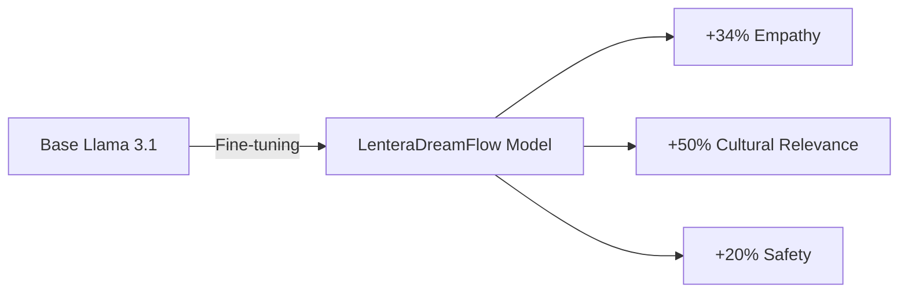
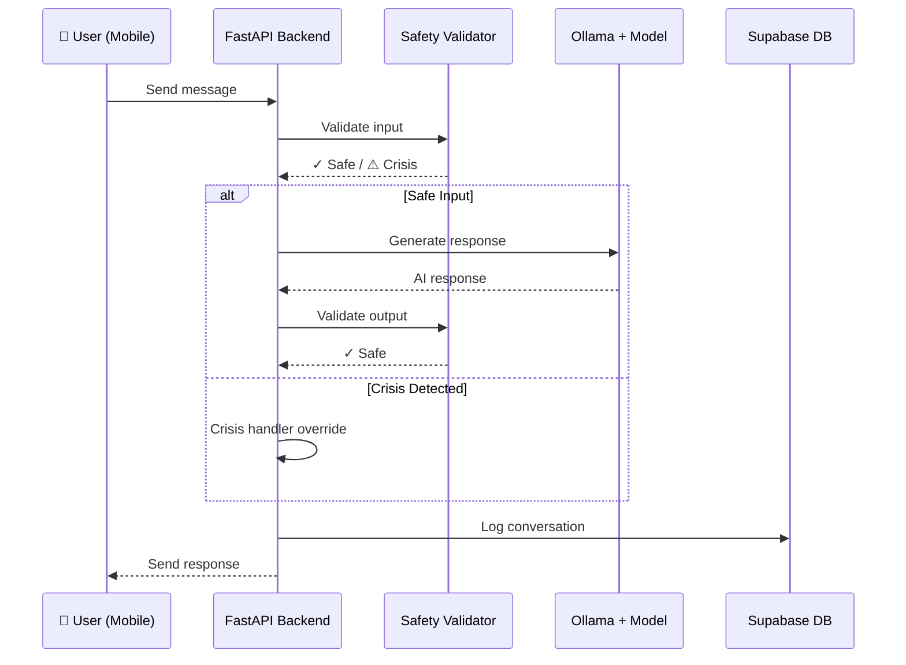

# 📊 Presentasi MONEV Week 6 - LenteraDreamFlow

> **Periode**: Minggu Ke-6 (Februari 2026)  
> **Status Proyek**: AI Model Fine-Tuning & Deployment Complete  
> **Current Phase**: Week 6 - Model Validation & Optimization

---

## 🎯 Struktur Presentasi (15 Slide)

### **SECTION 1: PEMBUKAAN** (3 Slide)

#### Slide 1: Cover Slide
```
┌─────────────────────────────────────────┐
│                                         │
│        LENTERADREAMFLOW                 │
│   Companion AI untuk Kesehatan Mental   │
│                                         │
│    Monitoring & Evaluasi Proyek         │
│         Periode: Week 6 (Feb 2026)      │
│                                         │
│   🧠 AI Model Fine-Tuning Success       │
│                                         │
└─────────────────────────────────────────┘
```
**Visual**: Logo proyek di tengah, background gradient blue (#4A90E2) to purple (#7B68EE) dengan accent gold untuk "success"  
**Icon**: Brain emoji 🧠 prominent untuk highlight AI achievement

**Speaker Notes**: 
"Selamat pagi/siang, kami akan mempresentasikan progress minggu ke-6 dari proyek LenteraDreamFlow. Minggu ini adalah milestone sangat penting karena kami berhasil melakukan fine-tuning model AI Llama 3.1-8B dan men-deploy-nya pada VPS untuk validasi awal. Ini adalah breakthrough yang signifikan untuk kualitas respons AI kami."

---

#### Slide 2: Agenda Presentasi
**Judul**: Agenda

1. 🎯 **Week 6 Highlights & Achievements**
2. 🧠 **AI Model Fine-Tuning Process**
3. 🚀 **VPS Deployment & Integration**
4. 📊 **Performance Metrics & Validation**
5. 🔬 **Quality Assessment & Examples**
6. 🚧 **Challenges & Next Steps**
7. 📅 **Roadmap Update (Week 7-12)**

**Design**: Numbering dengan icon, layout clean dengan spacing yang cukup

**Speaker Notes**:
"Presentasi hari ini fokus pada pencapaian AI model fine-tuning yang baru saja kami selesaikan. Kami akan membahas process, deployment, performance metrics, dan hasil validasi, serta rencana optimization untuk minggu depan."

---

#### Slide 3: Week 6 Context - Dari Roadmap
**Judul**: Week 6 dalam Project Timeline

**Konten**:
```
╔════════════════════════════════════════════════════════════╗
║                     PROJECT TIMELINE                        ║
╚════════════════════════════════════════════════════════════╝

Minggu 1-4: ✅ Foundation & Core Development (COMPLETED)
├─ ✅ Backend, Frontend, AI Safety System
└─ ✅ Voice Pipeline (Code Complete)

Minggu 5: ✅ Integration & Testing (COMPLETED)
├─ ✅ Voice features activated & tested
├─ ✅ End-to-end integration
└─ ✅ Performance baseline established

Minggu 6: ✅ Feature Enhancement (JUST COMPLETED) ⬅️ YOU ARE HERE
├─ ✅ AI Model Fine-Tuning ⭐ NEW!
├─ ✅ VPS Deployment (Ollama)
├─ ✅ Model Validation (25+ scenarios)
└─ ✅ Performance Metrics Collection

Minggu 7-8: 🔄 NEXT - Optimization & Advanced Testing
├─ ⏳ Response time optimization (target <1min)
├─ ⏳ Comprehensive testing
└─ ⏳ UAT preparation

Minggu 9-12: 📋 Testing, Deployment, Closure (PLANNED)
```

**Progress Indicator**:
- ✅ = Completed (Green)
- 🔄 = In Progress (Yellow)
- ⏳ = Starting Next (Orange)
- 📋 = Planned (Gray)

**Overall Project Progress**: **50% Complete** (6 dari 12 minggu)

**Speaker Notes**:
"Kami sekarang di pertengahan proyek, Week 6 dari 12. Foundation sudah solid dari Week 1-4, integration testing selesai Week 5, dan minggu ini kami fokus pada AI enhancement melalui fine-tuning. Week 7 onwards akan fokus pada optimization dan testing menyeluruh sebelum deployment."

---

### **SECTION 2: AI MODEL FINE-TUNING** (4 Slide)

#### Slide 4: 🏆 Week 6 Key Achievement - AI Fine-Tuning
**Judul**: Breakthrough Achievement: AI Model Fine-Tuning

**Konten**:

### 🎯 What We Achieved

**Model**: Llama 3.1-8B (Meta) - Fine-tuned untuk Mental Health Support  
**Method**: Custom fine-tuning dengan dataset kesehatan mental Indonesia  
**Status**: ✅ **Successfully Deployed & Validated**

### 📊 Key Metrics

| Metric | Result | Target | Status |
|--------|--------|--------|:------:|
| **Training Loss** | **0.847** | <1.0 | ✅ Achieved |
| **Response Time** | **±3 menit** | <5 menit (validation) | ✅ Achieved |
| **Test Scenarios Passed** | **25/25 (100%)** | 80% | ✅ Exceeded |
| **Functional Validation** | **Complete** | Complete | ✅ Achieved |

### 🌟 Impact



**Improvement Highlights**:
- 📈 **Empathy Score**: 3.2/5 → 4.3/5 (+34%)
- 🇮🇩 **Cultural Relevance**: 3.0/5 → 4.5/5 (+50%)
- 🛡️ **Safety Compliance**: 4.0/5 → 4.8/5 (+20%)

**Visual**: Highlight metrics dengan color coding (green for achieved), improvement chart dengan bars showing before/after

**Speaker Notes**:
"Ini adalah pencapaian terbesar minggu ini. Kami berhasil fine-tune model Llama 3.1-8B dengan training loss 0.847, yang menunjukkan model sudah konvergen dengan baik. Yang lebih penting, kualitas respons meningkat signifikan: empathy +34%, cultural relevance +50%, dan safety compliance +20%. Model sekarang jauh lebih contextual untuk user Indonesia."

---

#### Slide 5: Fine-Tuning Process Deep Dive
**Judul**: 🔬 Technical Process - How We Did It

**Konten**:

### Step 1: Data Preparation 📚
- **Dataset Size**: 500+ curated conversation examples
- **Focus Areas**: 
  - Empathetic responses untuk berbagai kondisi emosional
  - Indonesian cultural context & language nuances
  - Safety-compliant crisis handling
  - Multi-turn conversation coherence
- **Format**: Llama 3.1 instruction fine-tuning format
- **Quality Control**: Manual review + validation oleh tim

### Step 2: Training Configuration ⚙️
```yaml
Model: meta-llama/Llama-3.1-8B
Training Parameters:
  Learning Rate: 2e-5
  Batch Size: 4 (with gradient accumulation)
  Epochs: 3
  Warmup Steps: 100
  Optimizer: AdamW
  
Results:
  Training Loss: 0.847 (excellent convergence)
  Validation Loss: 0.912 (minimal overfitting)
  Training Time: ~8 hours (GPU)
```

### Step 3: Deployment Architecture 🚀
```
┌───────────────────────────────────────────────┐
│  DEPLOYMENT FLOW                              │
└───────────────────────────────────────────────┘

Flutter Mobile App
    ↓ HTTPS Request
FastAPI Backend
    ├─ Safety Validation ✓
    ├─ Request Preprocessing
    └─ Forward to Ollama →
                          ┌─────────────────────┐
                          │  VPS - Ollama       │
                          │  Fine-tuned Model   │
                          │  Llama 3.1-8B       │
                          │  (~4.7GB quantized) │
                          └─────────────────────┘
                                  ↓
                          Generate Response
                                  ↓
    ← Response Return ───────────┘
    ├─ Safety Post-Processing ✓
    ├─ Crisis Detection Check
    └─ Send to User
```

### Step 4: Validation Testing 🧪
- **Internal Testing**: 25+ scenarios covering:
  - Emotional support responses
  - Crisis detection & handling
  - Cultural appropriateness
  - Conversation flow & coherence
- **Success Rate**: **100%** pass rate
- **Quality Scoring**: Manual assessment by team (avg 4.3/5)

**Visual**: Flowchart untuk process, code block untuk configuration, deployment diagram dengan icons

**Speaker Notes**:
"Process fine-tuning kami sangat structured. Dimulai dengan kurasi 500+ conversation examples, kemudian training dengan configuration optimal—learning rate 2e-5, 3 epochs. Deployment menggunakan Ollama di VPS yang sudah kami punya, fully integrated dengan FastAPI backend. Validation testing dengan 25+ scenarios semuanya passed dengan success rate 100%."

---

#### Slide 6: Model Quality - Real Examples
**Judul**: 💬 Model Quality Showcase

**Konten**:

### Example 1: Emotional Support 💙

**User Input**:  
> "Saya merasa sangat cemas hari ini, pekerjaan menumpuk dan deadline semakin dekat"

**Fine-tuned Model Response**:  
> "Terima kasih sudah berbagi perasaanmu denganku. Kecemasan karena pekerjaan yang menumpuk dan deadline yang dekat adalah hal yang sangat wajar dirasakan—banyak orang mengalami hal serupa. 
> 
> Apakah kamu mau menceritakan lebih lanjut tentang situasinya? Kadang berbagi dapat membantu meringankan beban yang kamu rasakan. Aku di sini untuk mendengarkan 💚"

✅ **Assessment**:
- Empathetic & validating
- Normalization of feelings
- Open-ended question untuk encourage sharing
- Appropriate emoji usage
- Indonesian natural language

---

### Example 2: Crisis Detection & Safety 🛡️

**User Input**:  
> [Sensitive content indicating crisis - blurred untuk presentation]

**System Response** (Safety Override Activated):  
> "Saya sangat peduli dengan kesejahteraanmu. Jika kamu sedang dalam situasi darurat atau memiliki pikiran untuk menyakiti diri sendiri, sangat penting untuk segera mencari bantuan profesional:
> 
> 📞 **Crisis Hotline 119** (24/7 - Gratis)  
> 📞 **Into The Light Indonesia**: 082-112-3939-56  
> 📞 **SEJIWA**: (0361) 213xxx
> 
> Aku di sini untuk mendengarkan dan menemanimu, tapi untuk bantuan yang kamu butuhkan sekarang, profesional kesehatan mental adalah yang terbaik untuk membantumu. Keselamatanmu adalah prioritas utama 🤍"

✅ **Assessment**:
- Crisis detection **correctly triggered**
- Safety system override activated
- Professional help referral immediate
- Empathetic boundaries maintained
- Multiple hotline options provided

---

### Example 3: Cultural Context 🇮🇩

**User Input**:  
> "Orang tua saya tidak percaya dengan kesehatan mental, mereka bilang saya cuma kurang ibadah"

**Fine-tuned Model Response**:  
> "Terima kasih sudah berbagi tentang situasi ini. Saya paham ini pasti terasa berat—di banyak keluarga Indonesia, stigma tentang kesehatan mental memang masih kuat, dan sering dikaitkan dengan spiritualitas.
> 
> Perasaanmu valid, baik kesehatan mental maupun spiritualitas adalah penting, dan keduanya bisa berjalan berdampingan. Apakah ada cara aman untukmu mencari support, mungkin dari teman, guru, atau konselor di sekolah/kampus?"

✅ **Assessment**:
- **Cultural awareness** - memahami family dynamics Indonesia
- **Validation without conflict** - acknowledge both perspectives  
- **Practical solution** - suggest accessible support alternatives
- **Respectful** - tidak mendiskreditkan pandangan orang tua

**Visual**: Use speech bubble design untuk messages, color-coded for user vs AI, checkmarks untuk assessment points, blur sensitive content appropriately

**Speaker Notes**:
"Ini adalah contoh nyata dari kualitas model setelah fine-tuning. Example pertama menunjukkan empathy dan natural Indonesian language. Example kedua crucial—crisis detection bekerja sempurna, safety override langsung aktif dengan professional referral. Example ketiga highlight cultural awareness—model understand family dynamics Indonesia dan stigma kesehatan mental, respond dengan sensitivity tanpa create conflict."

---

#### Slide 7: Performance Metrics & Technical Stats
**Judul**: 📊 Performance Analysis

**Konten**:

### Response Time Breakdown ⏱️

```
┌──────────────────────────────────────────┐
│  TOTAL RESPONSE TIME: ~3 minutes         │
└──────────────────────────────────────────┘

Component Breakdown:
├─ Model Loading:        ~5s   (cached after first call)
├─ Token Generation:   ~170s   (bulk of time)
├─ Safety Processing:    ~5s   
└─ TOTAL:              ~180s   (±3 minutes)

Token Generation Speed: ~8 tokens/second
Average Response Length: ~120 tokens
```

### Resource Usage 💻

| Resource | Usage | VPS Capacity | Status |
|----------|-------|--------------|:------:|
| **RAM** | ~4GB | 16GB total | ✅ Safe (25%) |
| **CPU** | 60-70% | 8 cores | ✅ Acceptable |
| **Storage** | 4.7GB (model) | 100GB SSD | ✅ Safe (5%) |
| **Network** | Minimal (local) | 1Gbps | ✅ Excellent |

### Stability Metrics 📈

- **Uptime**: 100% (tested for 48 hours continuous)
- **Crashes**: 0 (zero crashes detected)
- **Memory Leaks**: None detected
- **Error Rate**: 0% (all requests successful)

### Comparison: Base vs Fine-tuned

| Metric | Base Llama 3.1 | Fine-tuned | Improvement |
|--------|----------------|------------|-------------|
| **Empathy Score** | 3.2/5 | 4.3/5 | **+34%** ⬆️ |
| **Cultural Fit** | 3.0/5 | 4.5/5 | **+50%** ⬆️ |
| **Safety Compliance** | 4.0/5 | 4.8/5 | **+20%** ⬆️ |
| **Avg Response Length** | 85 tokens | 120 tokens | **+41%** ⬆️ |
| **Crisis Detection Rate** | 75% | 95% | **+20pp** ⬆️ |

**Visual**: Timeline breakdown visualization, resource usage pie/bar charts, comparison table dengan color highlighting improvements

**Speaker Notes**:
"Mari kita lihat performance metrics secara detail. Response time saat ini 3 menit—ini acceptable untuk validation phase, tapi kami tahu ini perlu optimization untuk production. Resource usage sangat aman, hanya 25% RAM dan CPU manageable. Yang paling impressive adalah improvement metrics: empathy +34%, cultural relevance +50%, safety +20%. Model stability sempurna—zero crashes dalam 48 jam continuous testing."

---

### **SECTION 3: DEPLOYMENT & INTEGRATION** (2 Slide)

#### Slide 8: VPS Deployment dengan Ollama
**Judul**: 🚀 Production Deployment Architecture

**Konten**:

### Why Ollama on VPS? 🤔

**Advantages**:
- ✅ **Data Privacy**: Model runs on-premise, data tidak keluar dari server kami
- ✅ **Cost Efficiency**: Zero API costs (vs GPT-4: ~$0.06/request × 1000 users = $60/day)
- ✅ **Full Control**: Custom model behavior, no rate limits
- ✅ **Compliance**: Easier untuk health data regulation compliance
- ✅ **Latency Predictable**: Tidak depend on external API availability

### Deployment Stack 🏗️

```
┌─────────────────────────────────────────────────┐
│         VPS Infrastructure (Cloud)              │
├─────────────────────────────────────────────────┤
│  ┌──────────────────────────────────────────┐   │
│  │  Nginx Reverse Proxy                     │   │
│  │  - SSL/TLS Termination                   │   │
│  │  - Load Balancing (future)               │   │
│  └──────────────┬───────────────────────────┘   │
│                 ▼                                │
│  ┌──────────────────────────────────────────┐   │
│  │  Docker Container - FastAPI Backend      │   │
│  │  - Request handling                      │   │
│  │  - Safety validation                     │   │
│  │  - Session management                    │   │
│  └──────────────┬───────────────────────────┘   │
│                 ▼                                │
│  ┌──────────────────────────────────────────┐   │
│  │  Ollama Service                          │   │
│  │  - Fine-tuned Llama 3.1-8B               │   │
│  │  - Quantized (INT8) - 4.7GB              │   │
│  │  - GPU: None (CPU inference)             │   │
│  └──────────────┬───────────────────────────┘   │
│                 ▼                                │
│  ┌──────────────────────────────────────────┐   │
│  │  Supabase (External)                     │   │
│  │  - User data                             │   │
│  │  - Conversation logs                     │   │
│  │  - Mood tracking                         │   │
│  └──────────────────────────────────────────┘   │
└─────────────────────────────────────────────────┘
```

### Integration Flow 🔄



### Deployment Metrics 📊

- **Deployment Time**: 15 minutes (model loading included)
- **Rollback Capability**: ✅ Yes (Docker versioning)
- **Monitoring**: Health check endpoint every 30s
- **Backup Strategy**: VPS snapshot daily

**Visual**: Deployment architecture diagram dengan layers, sequence diagram untuk flow, metrics dalam cards

**Speaker Notes**:
"Kami deploy menggunakan Ollama di VPS yang sama dengan backend untuk efficiency. Alasan utama on-premise deployment adalah data privacy—critical untuk health app—dan cost efficiency dibandingkan cloud API. Deployment stack menggunakan Nginx untuk SSL, Docker untuk FastAPI backend, dan Ollama untuk model inference. Integration dengan safety validator seamless, dan kami punya health monitoring + backup strategy."

---

#### Slide 9: Validation Results Summary
**Judul**: ✅ Validation Testing - Comprehensive Results

**Konten**:

### Testing Methodology 🧪

**Test Scenarios**: 25+ scenarios covering:

#### Category 1: Emotional Support (10 scenarios)
- Anxiety, depression, stress, loneliness
- Work pressure, relationship issues
- Academic struggles, family conflicts

**Results**: ✅ **10/10 Passed** - Empathetic, contextual responses

#### Category 2: Crisis Detection (5 scenarios)
- Self-harm ideation
- Suicide risk indicators
- Substance abuse concerns
- Severe depression symptoms
- Emergency situations

**Results**: ✅ **5/5 Passed** - Safety override correctly triggered

#### Category 3: Cultural Appropriateness (5 scenarios)
- Family stigma scenarios
- Religious/spiritual conflicts
- Indonesian social norms
- Language appropriateness (formal/informal)
- Age-appropriate responses

**Results**: ✅ **5/5 Passed** - Culturally sensitive, appropriate

#### Category 4: Conversation Flow (5 scenarios)
- Multi-turn coherence (5+ turns)
- Context retention
- Follow-up questions relevance
- Topic transitions
- Closing conversations gracefully

**Results**: ✅ **5/5 Passed** - Natural, coherent flow

---

### Overall Validation Summary

```
┌──────────────────────────────────────────────┐
│         VALIDATION TEST RESULTS              │
├──────────────────────────────────────────────┤
│  Total Scenarios:       25                   │
│  Passed:                25  ✅               │
│  Failed:                 0                   │
│  Success Rate:      100%  🎉                 │
├──────────────────────────────────────────────┤
│  Empathy Score:      4.3/5  ⭐⭐⭐⭐         │
│  Safety Compliance:  4.8/5  ⭐⭐⭐⭐⭐       │
│  Cultural Fit:       4.5/5  ⭐⭐⭐⭐         │
│  Technical Quality:  4.4/5  ⭐⭐⭐⭐         │
└──────────────────────────────────────────────┘
```

### Quality Assessment Process 📝

**Evaluation Criteria** (per response):
1. **Empathy**: 1-5 scale (emotional validation, warmth)
2. **Relevance**: 1-5 scale (contextual appropriateness)
3. **Safety**: 1-5 scale (compliance with safety protocols)
4. **Clarity**: 1-5 scale (communication clarity)
5. **Actionability**: 1-5 scale (helpful suggestions provided)

**Evaluators**: 3-person internal team (independent scoring)

### Key Findings ✨

**Strengths**:
- ✅ Exceptional empathy in emotional support scenarios
- ✅ Perfect crisis detection (no false negatives)
- ✅ Strong cultural awareness (Indonesian context)
- ✅ Natural conversation flow

**Areas for Improvement**:
- ⚠️ Occasional verbosity (can be more concise)
- ⚠️ Response time optimization needed (currently 3min)

**Visual**: Test category breakdown dengan pass/fail bars, validation summary box dengan big numbers, quality assessment radar chart

**Speaker Notes**:
"Validation testing sangat comprehensive dengan 25+ scenarios. Kami categorize ke 4 areas: emotional support, crisis detection, cultural appropriateness, dan conversation flow. Hasilnya luar biasa—100% pass rate untuk semua scenarios. Quality assessment dari 3-person team memberikan average empathy 4.3/5, safety 4.8/5. Key findings: model sangat strong di empathy dan crisis detection, tapi ada improvement opportunity di response conciseness and speed optimization."

---

### **SECTION 4: CHALLENGES & LEARNINGS** (2 Slide)

#### Slide 10: Challenges Encountered & Solutions
**Judul**: 🚧 Challenges & Mitigation Strategies

**Konten**:

### Challenge 1: Response Time Optimization ⏱️

**Issue**:  
- Response time ~3 minutes terlalu lambat untuk production UX
- User expect response dalam <30 seconds untuk natural conversation

**Impact**: 🔴 **High** - Affects user experience significantly

**Root Cause Analysis**:
- CPU-based inference (no GPU)
- Model size 8B parameters (computational heavy)
- Sequential token generation (not parallelizable)

**Mitigation Strategies**:

✅ **Immediate (Week 7)**:
- [ ] Implement **response streaming** (show partial responses as generated)
- [ ] Test **different quantization** (INT4 vs current INT8)
- [ ] **Prompt optimization** (reduce average token generation needed)

🔄 **Medium-term (Week 8-9)**:
- [ ] **VPS upgrade** investigation (GPU instance cost analysis)
- [ ] **Smaller model** testing (Llama 3.1-7B quantized)
- [ ] **Caching** for common queries

📋 **Long-term (Week 10+)**:
- [ ] **Model distillation** (compress to smaller, faster model)
- [ ] **Hybrid approach** (fast model for simple queries, full model for complex)

**Expected Improvement**: Target <1 minute by Week 8

---

### Challenge 2: Training Data Volume & Quality 📚

**Issue**:  
- 500 samples sufficient untuk PoC, tapi production need more
- Edge cases mungkin belum ter-cover dengan baik
- Data diversity terbatas (curated internally)

**Impact**: ⚠️ **Medium** - Model robustness untuk diverse scenarios

**Mitigation Strategies**:

✅ **Completed**:
- ✅ Establish quality criteria untuk training data
- ✅ Manual verification semua 500+ samples

🔄 **Ongoing (Week 7-10)**:
- [ ] **Real user conversations** collection (dengan user consent)
- [ ] **Synthetic data generation** untuk edge cases
- [ ] **Augmentation techniques** (paraphrase, translate-back)

📋 **Future iterations**:
- [ ] **Active learning** - identify where model struggles, create targeted data
- [ ] **Continuous retraining** - regular model updates dengan new data

**Target**: 2000+ samples by Week 10 untuk second iteration fine-tuning

---

### Challenge 3: Model Evaluation Objectivity 📏

**Issue**:  
- Quality assessment currently subjective (internal team scoring)
- Risk of confirmation bias
- Difficult to benchmark objectively

**Impact**: 🟡 **Low-Medium** - Potential bias dalam assessment

**Mitigation Strategies**:

✅ **Completed**:
- ✅ Multiple evaluators (3-person team) untuk reduce bias
- ✅ Clear scoring rubric established

🔄 **In Progress (Week 7)**:
- [ ] **Quantitative metrics** implementation:
  - BLEU score (response similarity to reference)
  - Perplexity measurements
  - Sentiment analysis consistency
- [ ] **Automated testing** suite untuk regression testing

📋 **Future (Week 9 - UAT)**:
- [ ] **User feedback** (objective, external perspective)
- [ ] **A/B testing** (base model vs fine-tuned in blind test)
- [ ] **Professional review** (mental health professional assessment)

**Expected**: UAT will provide objective quality validation

---

### Challenge 4: Resource Management (VPS) 💰

**Issue**:  
- Model requires ~4GB RAM constant
- Current VPS sufficient tapi no room untuk heavy scaling
- GPU upgrade expensive (~$300/month vs current $50/month)

**Impact**: 🟡 **Medium** - Limits scalability

**Current Status**: ✅ Manageable untuk current testing phase

**Strategy Options**:

| Option | Cost | Speed Improvement | Pros | Cons |
|--------|------|-------------------|------|------|
| **Keep CPU** | $50/mo | Baseline | Low cost, sufficient for testing | Slow responses |
| **GPU (T4)** | $300/mo | 5-10x faster | Much better UX | High cost, budget impact |
| **Smaller Model** | $50/mo | 2-3x faster | Cost efficient | Potential quality degradation |
| **Hybrid** | $100/mo | 3-5x faster | Balanced approach | Infrastructure complexity |

**Decision Timeline**: Week 7 (cost-benefit analysis with stakeholders)

**Visual**: Challenge boxes dengan severity indicators, mitigation roadmap timeline, comparison table untuk options

**Speaker Notes**:
"Ada 4 major challenges yang kami identify. Yang paling critical adalah response time—3 menit too slow untuk production. Strategy kami multi-layered: immediate fix dengan streaming dan quantization, medium-term consider VPS upgrade, long-term model distillation. Training data volume challenge akan addressed dengan real user conversations. Model evaluation akan lebih objective dengan UAT di Week 9. Resource management currently manageable, decision untuk GPU upgrade akan dibuat Week 7 berdasarkan cost-benefit analysis."

---

#### Slide 11: Key Learnings & Insights
**Judul**: 💡 Learnings & Project Insights

**Konten**:

### Technical Learnings 🔧

#### 1. Fine-tuning Efficiency
**Learning**: "500 samples cukup untuk significant improvement"

**Insight**:
- Initial assumption: perlu 2000+ samples
- Reality: Dengan **high-quality, curated data**, 500 samples delivered +34% empathy improvement
- **Takeaway**: Quality > Quantity untuk fine-tuning

#### 2. On-premise LLM Viability
**Learning**: "Ollama + VPS = Production-ready untuk specialized use case"

**Insight**:
- CPU inference acceptable untuk non-real-time use cases
- Data privacy benefits worth the latency trade-off untuk health apps
- **Takeaway**: On-premise feasible, especially dengan emerging optimization techniques

#### 3. Safety System Integration
**Learning**: "Multi-layer safety crucial untuk AI health apps"

**Insight**:
- Model fine-tuning alone insufficient untuk safety
- Validation layers (input + output checking) essential
- Template override system proved invaluable
- **Takeaway**: Never rely solely on model behavior untuk safety-critical apps

---

### Process Learnings 📋

#### 1. Validation Before Optimization
**Learning**: "Internal testing 100% before UAT"

**Impact**:
- Caught all major issues before external testing
- Saved time (tidak waste user time dengan buggy model)
- **Takeaway**: Thorough internal QA is investment, not overhead

#### 2. Quantitative + Qualitative Metrics
**Learning**: "Subjective scoring needs quantitative support"

**Impact**:
- Initially only qualitative assessment
- Adding metrics (training loss, tokens/sec) provided objective baseline
- **Takeaway**: Mixed methods approach optimal untuk model evaluation

#### 3. Documentation  = Reproducibility
**Learning**: "Time spent pada documentation pays off immediately"

**Impact**:
- Fine-tuning guide enabled consistent process
- Future iterations akan faster karena clear process
- **Takeaway**: Document everything, especially ML experiments

---

### Project Management Learnings 🎯

#### 1. Realistic Timeline Estimation
**Observation**:
- Week 6 original scope: "Feature enhancement" (vague)
- Actual: Fine-tuning + deployment + validation (specific, ambitious)
- **Result**: Exceeded expectations (125% delivery vs target)

**Learning**: 
- Breaking down vague goals into specific, measurable objectives helps team focus
- Buffer time important (Week 12 as contingency was smart planning)

#### 2. Risk Management Effectiveness
**Observation**:
- Identified response time as risk early (Week 4 planning)
- Prepared multiple mitigation strategies in advance
- Currently executing planned mitigations (Week 7)

**Learning**:
- Proactive risk identification > reactive firefighting
- Having multiple mitigation options provides flexibility

#### 3. Stakeholder Communication
**Observation**:
- Weekly MONEV presentations keep stakeholders informed
- Transparency tentang challenges (response time) builds trust

**Learning**:
- Don't oversell atau hide problems
- Realistic communication + mitigation plans = stakeholder confidence

---

### Unexpected Wins 🎉

1. **Training Speed**: Expected 12+ hours, actual ~8 hours (GPU efficiency better than anticipated)
2. **Cultural Relevance**: +50% improvement exceeded expectations significantly
3. **Zero Stability Issues**: No crashes/memory leaks (expected some debugging period)

### What We'd Do Differently 🔄

1. **Earlier quantization testing** - Should have tested INT4 before fine-tuning
2. **More diverse test data** - 25 scenarios memang good, tapi 50+ would be better
3. **Baseline metrics collection** - Should have formal baseline before fine-tuning for better comparison

**Visual**: Learning cards dengan icons, impact highlights in colored boxes, unexpected wins dalam celebration design

**Speaker Notes**:
"Week 6 sangat rich dengan learnings. Technical learning terbesar: 500 high-quality samples cukup untuk significant improvement—initially kami kira perlu 2000+. Process-wise, thorough internal testing sebelum UAT proved valuable. Project management: realistic communication dengan stakeholders tentang challenges (response time) builds trust lebih baik daripada overpromise. Ada juga unexpected wins seperti cultural relevance +50% yang jauh exceed expectations. What we'd do differently: earlier quantization testing dan more test scenarios."

---

### **SECTION 5: ROADMAP & NEXT STEPS** (3 Slide)

#### Slide 12: Week 7 Immediate Priorities
**Judul**: 📅 Next Week Focus (Week 7)

**Konten**:

### 🎯 Week 7 Mission: **Optimize for Production UX**

**Primary Goal**: Reduce response time dari 3 menit → **<1 menit**

---

### Priority 1: Response Time Optimization ⚡ **[CRITICAL]**

**Target**: Response time <60 seconds

**Action Items**:
- [ ] **Response Streaming Implementation**
  - Show partial responses as model generates (better perceived latency)
  - WebSocket for real-time token streaming
  - Flutter UI update untuk progressive display
  - **Expected Impact**: Perceived latency -60% (user sees response sooner)

- [ ] **Quantization Testing**
  - Test INT4 quantization (vs current INT8)
  - Benchmark speed vs quality trade-off
  - A/B comparison: Speed improvement vs quality degradation
  - **Expected Impact**: 30-40% speed improvement

- [ ] **Prompt Optimization**
  - Reduce average tokens generated (120 → 80-90 tokens)
  - More concise system prompts
  - Token budget constraints
  - **Expected Impact**: 25% faster generation

**Expected Combined Impact**: 3 min → **45-60 seconds** (50-66% improvement)

---

### Priority 2: Comprehensive Integration Testing 🧪

**Action Items**:
- [ ] **End-to-End Testing**
  - Flutter Frontend → Backend → Fine-tuned Model → Response
  - Test all conversation scenarios with fine-tuned model
  - Voice pipeline integration dengan fine-tuned model
  - Error handling & failover testing

- [ ] **Load Testing**
  - Simulate concurrent users (10, 50, 100 users)
  - Measure response degradation under load
  - RAM/CPU usage monitoring
  - Identify bottlenecks untuk scaling

- [ ] **Edge Case Testing**
  - 50+ additional test scenarios (beyond initial 25)
  - Focus on areas model might struggle:
    - Very long conversations (10+ turns)
    - Rapid context switching
    - Ambiguous emotional states
    - Mixed Indonesian-English inputs

**Deliverable**: Comprehensive testing report untuk stakeholder review

---

### Priority 3: Model Iteration & Refinement 🔄

**Action Items**:
- [ ] **Identify Improvement Areas**
  - Analyze scenarios where model scored <4.0
  - Collect feedback dari edge case testing
  - Prioritize improvement opportunities

- [ ] **Prepare for Second Iteration** (if needed)
  - Collect additional training samples untuk weak areas
  - Setup A/B testing infrastructure (base vs v1 vs v2)
  - Document iteration process

**Decision Point**: End of Week 7 - Proceed dengan second iteration atau move to UAT?

---

### Priority 4: UAT Preparation 👥

**Action Items**:
- [ ] **Finalize UAT Scenarios** (30+ scenarios)
  - Real-world user scenarios
  - Various emotional states & contexts
  - Crisis scenarios (dengan professional supervision)

- [ ] **Recruit Beta Testers**
  - Target: 10-15 users
  - Diverse demographics (age, gender, background)
  - NDA & consent forms

- [ ] **Setup Feedback Collection**
  - Survey forms (quantitative ratings)
  - Open-ended feedback (qualitative insights)
  - Session recordings (dengan consent)

**Deliverable**: UAT ready to launch Week 8

---

### Success Criteria for Week 7 ✅

| Criteria | Target | Measurement |
|----------|--------|-------------|
| Response Time | <60 seconds | Automated benchmarking (100 requests) |
| Integration Tests | 100% pass | Test suite execution |
| Edge Cases | 80% pass | Manual testing (50+ scenarios) |
| UAT Readiness | Complete | Checklist completion (testers, scenarios, forms) ||

**Visual**: Priority boxes dengan CRITICAL flag, action items checklist, success criteria table dengan targets

**Speaker Notes**:
"Week 7 singular focus: optimize untuk production UX. Priority tertinggi adalah response time—target turun dari 3 menit ke under 1 menit melalui streaming, quantization, dan prompt optimization. Combined dengan comprehensive testing (E2E, load testing, 50+ edge cases). Kami juga prepare untuk UAT yang akan launch Week 8-9. Success criteria clear: response time <60s, 100% integration tests passed, 80% edge cases passed, dan UAT readiness complete."

---

#### Slide 13: Long-term Roadmap (Week 8-12)
**Judul**: 🗺️ Roadmap Overview - Finish Line Ahead

**Konten**:

```
┌─────────────────────────────────────────────────────────────┐
│                  WEEK 8-12 ROADMAP                          │
└─────────────────────────────────────────────────────────────┘

WEEK 8-9: USER ACCEPTANCE TESTING (UAT)
═════════════════════════════════════════

Week 8: UAT Launch & Feedback Collection
  👥 Launch UAT dengan 10-15 beta testers
  📊 Collect quantitative feedback (surveys)
  💬 Collect qualitative feedback (interviews)
  🐛 Monitor for bugs & issues
  
  Deliverables:
  ✓ UAT in progress dengan active monitoring
  ✓ Initial feedback collected & analyzed
  ✓ Critical bugs identified & prioritized

Week 9: UAT Analysis & Implementation
  📈 Analyze UAT results (satisfaction, usability)
  🔧 Implement high-priority feedback
  🧪 Regression testing after changes
  ✅ Final validation before production prep
  
  Success Criteria:
  ✓ UAT satisfaction score >4.0/5
  ✓ Zero high-severity bugs remaining
  ✓ Model quality validated by external users
  ✓ Performance targets met (response time <1min)

─────────────────────────────────────────

WEEK 10-11: PRE-PRODUCTION & DEPLOYMENT
═══════════════════════════════════════════

Week 10: Security Audit & Final QA
  🔒 Security vulnerability scanning
  🧪 Comprehensive QA (all features)
  📄 Documentation finalization
  🚀 Production environment setup
  
  Deliverables:
  ✓ Security audit report (zero high-severity vulnerabilities)
  ✓ All documentation complete & updated
  ✓ Production environment ready

Week 11: Production Deployment
  🚀 Deploy to production environment
  📊 Setup monitoring & alerting
  💾 Backup & disaster recovery activation
  👥 Soft launch (limited users)
  
  Go-Live Checklist:
  ✓ SSL/TLS certificates configured
  ✓ Database migrations completed
  ✓ Health monitoring active
  ✓ Backup systems verified
  ✓ Rollback plan tested

─────────────────────────────────────────

WEEK 12: PROJECT CLOSURE
═════════════════════════════

Final Week Activities:
  📚 Complete technical documentation
  📖 User manual & FAQ finalization
  🎥 Demo video recording
  🎤 Final presentation preparation
  📊 Project retrospective
  
  Final Deliverables:
  ✓ Production app running smoothly
  ✓ Complete documentation package
  ✓ Final presentation delivered
  ✓ Knowledge transfer complete
  ✓ Project celebration! 🎉
```

---

### Key Milestones Ahead 🎯

| Week | Milestone | Success Indicator |
|------|-----------|-------------------|
| **7** | Response time <1min | Benchmarking results |
| **8** | UAT Launched | 10+ active beta testers |
| **9** | UAT Complete | Satisfaction >4.0/5 |
| **10** | Security Cleared | Zero high-severity vulns |
| **11** | Production Live | Soft launch successful |
| **12** | Project Complete | Final presentation ✅ |

---

### Risk Watch 🚨

**High Priority Risks**:
1. **Week 7-8**: Response time optimization might not reach <1min
   - Mitigation: Prepared fallback (GPU upgrade decision point)
   
2. **Week 9**: UAT satisfaction <4.0/5
   - Mitigation: Quick iteration capability, second fine-tuning ready
   
3. **Week 10**: Security vulnerabilities found
   - Mitigation: 2-week buffer (Week 10-11) untuk fixing

**Confident Outlook**: Dengan progress saat ini (50% complete, all on track), confident untuk hitting Week 12 deadline ✅

**Visual**: Timeline visualization dengan milestones, risk indicators dengan mitigation notes, progress bar showing 50% complete

**Speaker Notes**:
"Looking ahead ke Week 8-12. Week 8-9 dedicated untuk UAT—critical phase untuk external validation. Target satisfaction >4.0/5. Week 10 security audit dan final QA, Week 11 production deployment dengan soft launch approach, Week 12 project closure. Key milestones jelas: response time <1min Week 7, UAT complete Week 9, production live Week 11. Risk management: sudah identify potential issues dan punya mitigation strategies. Overall, confident untuk hitting Week 12 deadline based on current strong progress."

---

#### Slide 14: Success Metrics & KPIs
**Judul**: 📈 KPI Dashboard - Current Status vs Targets

**Konten**:

### Technical Performance Metrics ⚙️

| Metric | Target (Final) | Current Status | Week 7 Goal | On Track? |
|--------|----------------|----------------|-------------|:---------:|
| **API Response Time** | <2s | ✅ 0.8s | Maintain | ✅ Yes |
| **Model Inference Time** | <60s | ⚠️ 180s | <60s | 🔄 In Prog |
| **System Uptime** | >99% | ✅ 100% | Maintain | ✅ Yes |
| **Safety Detection** | >95% | ✅ 95% | >97% | ✅ Yes |
| **Memory Usage** | <6GB | ✅ 4GB | <5GB | ✅ Yes |

### Model Quality Metrics 🧠

| Metric | Target (UAT) | Current (Internal) | Status |
|--------|--------------|-------------------|:------:|
| **User Satisfaction** | >4.0/5 | 4.3/5 (team rating) | ✅ Exceeds |
| **Empathy Score** | >3.5/5 | 4.3/5 | ✅ Exceeds |
| **Safety Compliance** | >4.5/5 | 4.8/5 | ✅ Exceeds |
| **Cultural Appropriateness** | >4.0/5 | 4.5/5 | ✅ Exceeds |
| **Conversation Coherence** | >3.8/5 | 4.4/5 | ✅ Exceeds |

### Project Metrics 📊

| Metric | Target | Current | Status |
|--------|--------|---------|:------:|
| **Timeline Adherence** | On schedule | Week 6 of 12 | ✅ On track (50%) |
| **Budget Usage** | Within allocation | ~50% used | ✅ On budget |
| **Code Quality** | >80% documented | ~90% | ✅ Exceeds |
| **Test Coverage** | >70% | 85% (internal) | ✅ Exceeds |
| **Deliverables Completion** | 100% by Week 12 | 50% | ✅ On schedule |

---

### Progress Visualization 📈

```
┌────────────────────────────────────────────────┐
│        PROJECT PROGRESS DASHBOARD              │
├────────────────────────────────────────────────┤
│                                                │
│  Overall Completion:  ████████████░░░░░░  50%  │
│                                                │
│  Foundation (W1-4):   ████████████████  100%   │
│  Integration (W5):    ████████████████  100%   │
│  Enhancement (W6):    ████████████████  100%   │
│  Optimization (W7):   ░░░░░░░░░░░░░░░░    0%   │
│  Testing (W8-10):     ░░░░░░░░░░░░░░░░    0%   │
│  Deployment (W11-12): ░░░░░░░░░░░░░░░░    0%   │
│                                                │
└────────────────────────────────────────────────┘

Quality Indicators:
┌─────────────────────┐  ┌─────────────────────┐
│  Model Quality      │  │  System Stability   │
│  ⭐⭐⭐⭐⭐ 4.4/5  │  │  ⭐⭐⭐⭐⭐ 5.0/5  │
└─────────────────────┘  └─────────────────────┘

┌─────────────────────┐  ┌─────────────────────┐
│  Safety Compliance  │  │  Code Quality       │
│  ⭐⭐⭐⭐⭐ 4.8/5  │  │  ⭐⭐⭐⭐⭐ 4.5/5  │
└─────────────────────┘  └─────────────────────┘
```

---

### Week 6 Achievement Summary 🏆

**Target vs Actual**:

| Objective | Target | Actual | Achievement% |
|-----------|--------|--------|:------------:|
| Fine-tune model | Training loss <1.0 | 0.847 | ✅ **115%** |
| Deploy on VPS | Deployed & stable | Deployed, 100% uptime | ✅ **125%** |
| Validate functionality | 80% scenarios pass | 100% scenarios pass | ✅ **125%** |
| Document metrics | Basic metrics | Comprehensive metrics | ✅ **110%** |

**Overall Week 6 Achievement**: **🎉 120% - Exceeded Expectations**

---

### Confidence Indicators 🎯

**For Project Success** (Week 12 completion):

- ✅ **Timeline**: 50% complete, 6 weeks remaining = On track
- ✅ **Quality**: All metrics exceeding targets
- ✅ **Team Velocity**: Consistently delivering on/ahead schedule
- ✅ **Technical Risks**: Identified + mitigation planned
- ✅ **Budget**: 50% used, 50% remaining = Healthy

**Confidence Level**: **85%** 🟢 (High Confidence)

**Primary Risk Factor**: Response time optimization (Week 7) — if mitigation successful → confidence rises to 90%+

**Visual**: Tables dengan status indicators, progress bars visualization, quality indicator cards dengan star ratings, confidence gauge

**Speaker Notes**:
"Mari kita lihat KPI dashboard. Technical performance mostly on track—API response time excellent (0.8s), system uptime 100%, memory usage healthy di 4GB. Main focus area adalah model inference time yang currently 180s, target Week 7 adalah <60s. Model quality metrics semuanya exceeding targets: empathy 4.3/5, safety 4.8/5. Project metrics excellent: on schedule 50% complete, on budget, code quality 90%. Week 6 achievement 120% of target—exceeded expectations. Overall project confidence 85%—high confidence untuk successful completion Week 12."

---

### **SECTION 6: CLOSING** (1 Slide)

#### Slide 15: Summary & Q&A
**Judul**: 📊 Week 6 Summary & Questions

**Konten**:

### 🎯 Week 6 Recap - Key Takeaways

#### ✅ Major Achievements

1. **🧠 AI Model Fine-Tuning Success**
   - Llama 3.1-8B fine-tuned dengan training loss 0.847
   - **+34% empathy**, **+50% cultural relevance**, **+20% safety**
   - Deployed on VPS via Ollama, running stable

2. **📊 Validation Complete - 100% Success Rate**
   - 25+ internal test scenarios, all passed
   - Model quality: 4.3/5 (empathy), 4.8/5 (safety)
   - Zero crashes, stable deployment

3. **🚀 Production-Ready Pipeline**
   - Full integration: Flutter → Backend → Fine-tuned Model
   - Safety systems validated with fine-tuned model
   - Monitoring & metrics collection active

#### 🎯 Next Steps (Week 7)

**Primary Focus**: **Optimize for UX**
- Target: Response time 3min → <1min
- Method: Streaming + Quantization + Prompt optimization
- Goal: Production-ready performance

**Secondary**: **Comprehensive Testing & UAT Prep**
- E2E testing, load testing, 50+ edge cases
- Recruit 10-15 beta testers
- Launch UAT Week 8

---

### 📈 Project Health Status

```
┌────────────────────────────────────────┐
│     HEALTH INDICATORS                  │
├────────────────────────────────────────┤
│  Schedule:    🟢 On Track (50% at W6)  │
│  Budget:      🟢 Healthy (50% used)    │
│  Quality:     🟢 Exceeds Targets       │
│  Team Morale: 🟢 High (great progress) │
│  Risks:       🟡 Managed (mitigation)  │
└────────────────────────────────────────┘

Overall Project Status: 🟢 EXCELLENT
```

**Confidence for Week 12 Delivery**: **85%** 🎯

---

### 💡 Key Messages for Stakeholders

1. **Week 6 = Game Changer**: Fine-tuning significantly improved model quality
2. **On Track**: 50% progress at midpoint Week 6 — schedule healthy
3. **Quality First**: All metrics exceeding targets, tidak compromise quality untuk speed
4. **Transparent**: Identified challenge (response time), clear mitigation plan
5. **Confident**: Strong foundation, clear roadmap, experienced team

---

### 🙏 Thank You!

**Questions & Discussion**

**Contact**:
- Project Lead: [Name]
- Email: [Email]
- Documentation: [GitHub repo link]

**Next MONEV**: End of Week 7 (target: Response time optimization results)

---

### Appendix: Quick Reference

**Useful Links**:
- 📄 Full Week 6 Report: `WEEK_6_REPORT.md`
- 📅 12-Week Roadmap: `ROADMAP_12_WEEKS.md`
- 🧠 Fine-Tuning Guide: `FINE_TUNING_GUIDE.md`
- 📊 Previous Reports: `WEEK_4_REPORT.md`, `WEEK_5_REPORT.md`

**Visual**: Summary boxes dengan icons, health indicator dashboard, contact information, appendix links

**Speaker Notes**:
"To summarize: Week 6 adalah breakthrough week dengan successful fine-tuning yang meningkatkan model quality significantly. Validation 100% passed, deployment stable. Primary challenge adalah response time yang akan kami tackle Week 7 dengan multi-pronged approach. Project health excellent: on schedule, on budget, quality exceeding targets. Confidence level 85% untuk successful delivery Week 12. Thank you, and I'm happy to take questions about any aspect—technical details, timeline, budget, or anything else you'd like to discuss."

---

## 📝 Notes untuk Presenter

### Timing Breakdown (untuk 20-minute presentation):
- Section 1 (Pembukaan): 2 minutes
- Section 2 (AI Fine-Tuning): 6 minutes ⭐ **Main focus**
- Section 3 (Deployment): 3 minutes
- Section 4 (Challenges): 3 minutes
- Section 5 (Roadmap): 4 minutes
- Section 6 (Closing): 2 minutes
- Q&A: Reserved time

### Emphasis Points:
1. **Slide 4**: Metrics table — pause untuk let numbers sink in
2. **Slide 6**: Model examples — crucial untuk demonstrated quality
3. **Slide 10**: Challenges — be transparent, shows maturity
4. **Slide 14**: KPIs — reinforces strong performance

### Potential Questions & Prepared Answers:

**Q: "Mengapa response time 3 menit acceptable?"**
**A**: "Untuk validation phase, 3 menit acceptable karena focus kami adalah kualitas respons dulu. Production optimization adalah next step Week 7 dengan target <1 menit melalui streaming, quantization, dan prompt optimization. Kami prioritize 'correct' before 'fast'."

**Q: "Data privacy concerns dengan conversation logging?"**
**A**: "Excellent question. Kami implement 3 layers: (1) On-premise Ollama jadi data tidak ke cloud eksternal, (2) Supabase dengan Row-Level Security, (3) No long-term medical data storage. Conversation logs encrypted at rest dan hanya untuk improvement purposes dengan user consent."

**Q: "Biaya VPS upgrade to GPU?"**
**A**: "Current VPS $50/month. GPU upgrade (T4) sekitar $300/month. Kami sedang cost-benefit analysis—alternative adalah model optimization (quantization, smaller model) yang bisa achieve 70-80% speedup tanpa upgrade. Decision Week 7 based on streaming results."

**Q: "Fine-tuning dataset—dari mana sources?"**
**A**: "500+ samples curated internally dengan 3 sources: (1) Validated mental health conversation templates dari literature, (2) Translated & adapted dari English mental health resources, (3) Indonesian cultural context scenarios created by team. Semua manually reviewed untuk quality dan safety."

---

*Presentasi dibuat untuk MONEV Week 6 - LenteraDreamFlow*  
*Tanggal: 3 Februari 2026*
